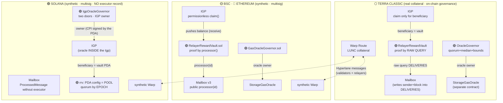
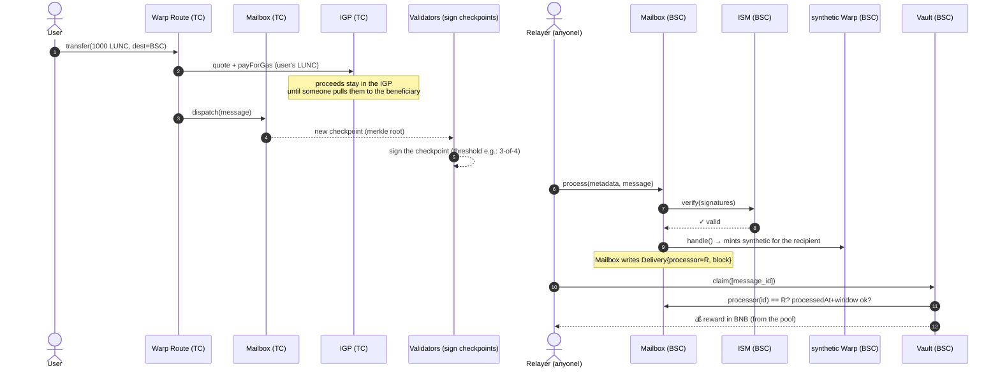
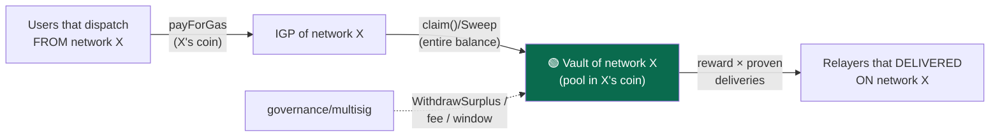
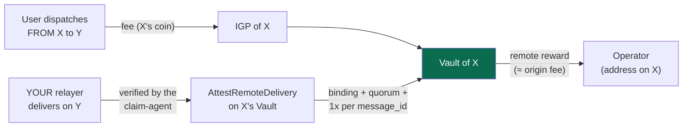
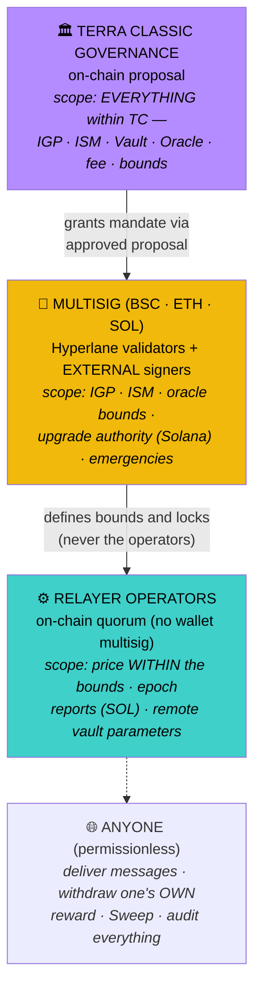
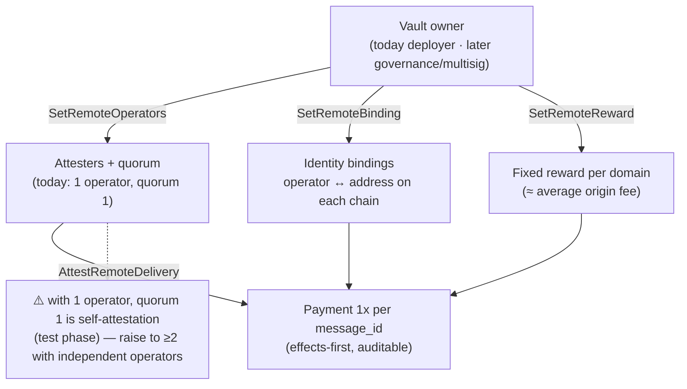
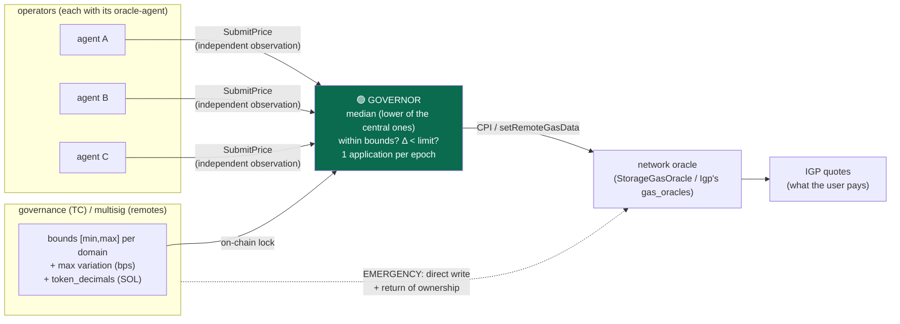
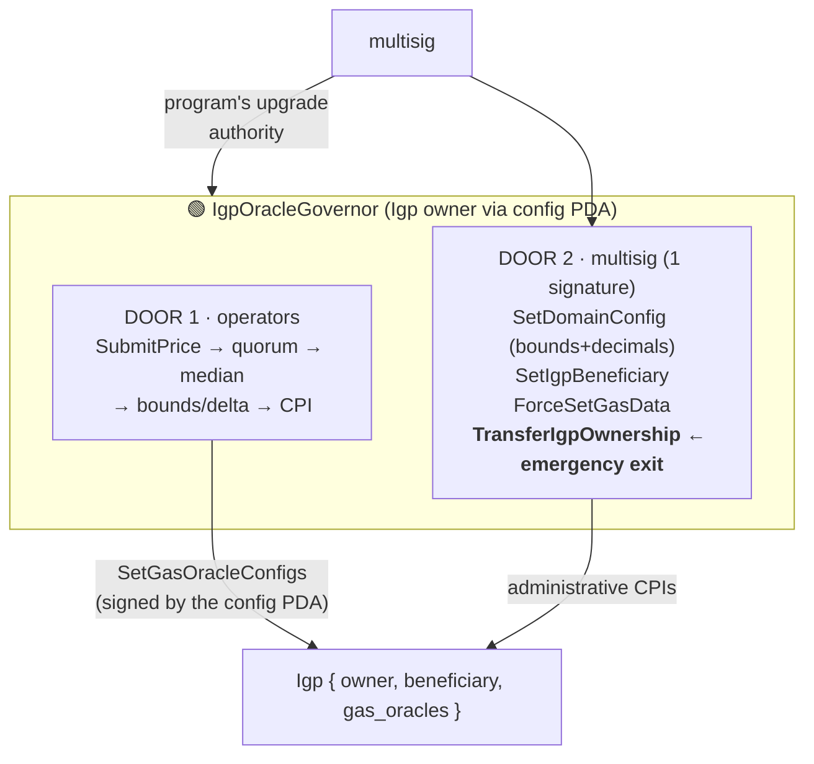

# Architecture — the whole picture

Diagrams of the complete system: the end-to-end Hyperlane process and where the
remuneration layer (this repository) fits in. The diagrams render on
GitHub (Mermaid). Normative details: `SPEC.html`.

---

## 1. Overview — the 4 networks and the two layers

The **Hyperlane core** (blue) is not modified; the **remuneration layer**
(green) only changes configuration: the `beneficiary` of each IGP becomes the Vault and, on
Solana, the `owner` of the IGP becomes the governor.

---

## 2. The complete Hyperlane process (with remuneration attached)

A TC → BSC transfer, from dispatch to the relayer's withdrawal — steps 1–8 are
the **unchanged core**; 9–11 are the **new layer**:

The return path (BSC → TC) is mirrored: the user pays BNB in the BSC IGP, the
relayer spends LUNC in the TC `process()` and withdraws from the **TC Vault** — each network
sustains itself on its own coin (spec §05).

---

## 3. Money flow (self-funded by construction)

No usage → no proceeds, but also no work. Fee < average proceeds
per delivery ⇒ the pool never becomes insolvent (spec §01/§05).

**v2 (ClaimRemote):** the ORIGIN network's pool also pays the message fee to the
operator that delivered it ON ANOTHER network — via quorum attestation (diagram 4b):

---

## 4. Proof of delivery — the three mechanisms

```mermaid
flowchart TB
    subgraph P1["TERRA CLASSIC · proof by raw query"]
        A1["Relayer calls Vault::Claim{ids}"] --> B1["raw query: key<br/>[0x00,0x0A]+'deliveries'+id"]
        B1 --> C1{"value parses<br/>{sender, block_number}?"}
        C1 -- "no" --> D1["⛔ MailboxLayoutMismatch<br/>(migrate detected — never pays wrong)"]
        C1 -- "yes" --> E1{"sender == relayer?<br/>within the window?<br/>not paid yet?"}
        E1 -- "yes (ALL ids)" --> F1["💰 BankMsg (atomic batch)"]
        E1 -- "no" --> G1["⛔ reverts the WHOLE BATCH"]
    end

    subgraph P2["BSC/ETHEREUM · direct proof"]
        A2["claim(ids)"] --> B2["mailbox.processor(id) == msg.sender?<br/>processedAt(id)+window ≥ block?"]
        B2 -- yes --> C2["💰 native transfer (atomic, reentrancy-guard)"]
    end

    subgraph P4["ANY ORIGIN · v2 ClaimRemote (REMOTE delivery attestation)"]
        A4["claim-agent verifies the delivery<br/>on the DESTINATION chain"] --> B4["AttestRemoteDelivery{domain, ids}<br/>on the ORIGIN chain's vault"]
        B4 --> C4{"attester registered?<br/>binding (operator,domain)?<br/>id never paid?"}
        C4 -- yes --> D4{"AGREEING attestations<br/>≥ quorum?"}
        D4 -- yes --> E4["💰 fixed reward for the domain<br/>to the bound operator (1x per id)"]
        D4 -- "not yet" --> F4["attestation recorded,<br/>awaits quorum (auditable)"]
        C4 -- no --> G4["⛔ reverts"]
    end

    subgraph P3["SOLANA · quorum by epoch (the chain does not record the executor)"]
        A3["6h epoch closes<br/>(+ finality slack)"] --> B3["each operator submits the report:<br/>window + credits ORDERED by key"]
        B3 --> C3{"identical hashes<br/>≥ quorum?"}
        C3 -- yes --> D3["credits assigned per operator<br/>(PDA OperatorCredit)"]
        C3 -- "divergence" --> E3["🚨 epoch locked — alarm,<br/>public audit of the reports"]
        D3 --> F3["Withdraw: lamports debit<br/>from the pool (respects rent-exempt)"]
    end
```

---

## 5. Governance org chart (spec §04)

Three spheres with non-overlapping scopes — the operational with whoever operates, the
structural with whoever holds a mandate:

> ⚠️ The project's #1 risk lives here: whoever controls the **remote Warp's ISM**
> has indirect access to the TC collateral (mint synthetic without backing → burn
> → legitimate message releases collateral). That is why the multisig can **never** be
> composed only of the validators that sign checkpoints, and the ISM swap requires a
> timelock (spec §12).

---

### 5b. ClaimRemote — who controls what (v2)

## 6. Price oracle — the same pattern across the 4 networks

The conflict of interest (operators control the price that funds their own
remuneration) is neutralized because the **bounds are defined by whoever does not operate**.

---

## 7. Solana — the two doors of the IgpOracleGovernor

On Solana the oracle lives INSIDE the `Igp` and only the owner writes — the governor becomes
the owner and rebuilds the separation of powers:

The separation becomes **logical** (governor code), not cryptographic —
which is why the three obligations of spec §08: `TransferIgpOwnership` tested before
the deploy (✅ tested in `svm/.../tests`), lamports kept in the config PDA, and
upgrade authority in the multisig.
