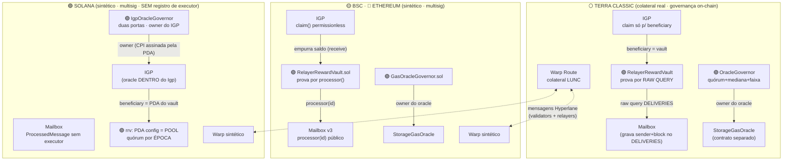
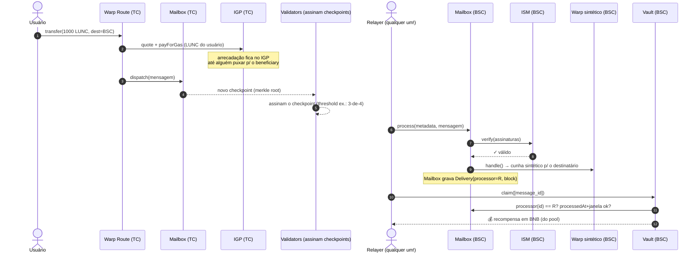
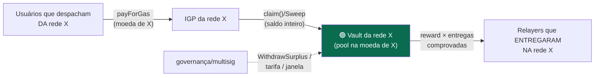
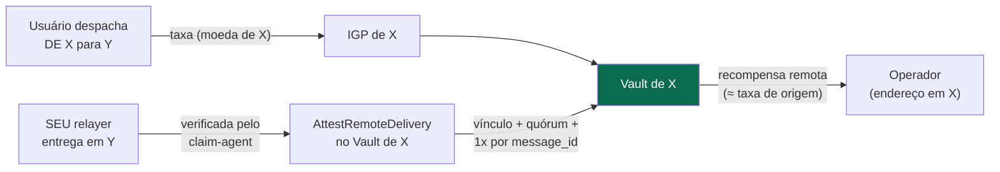
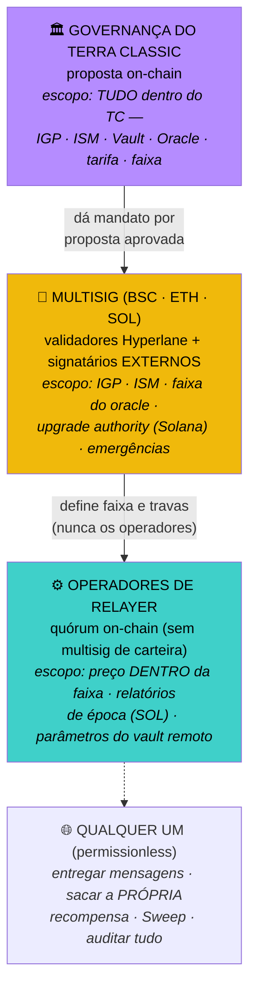
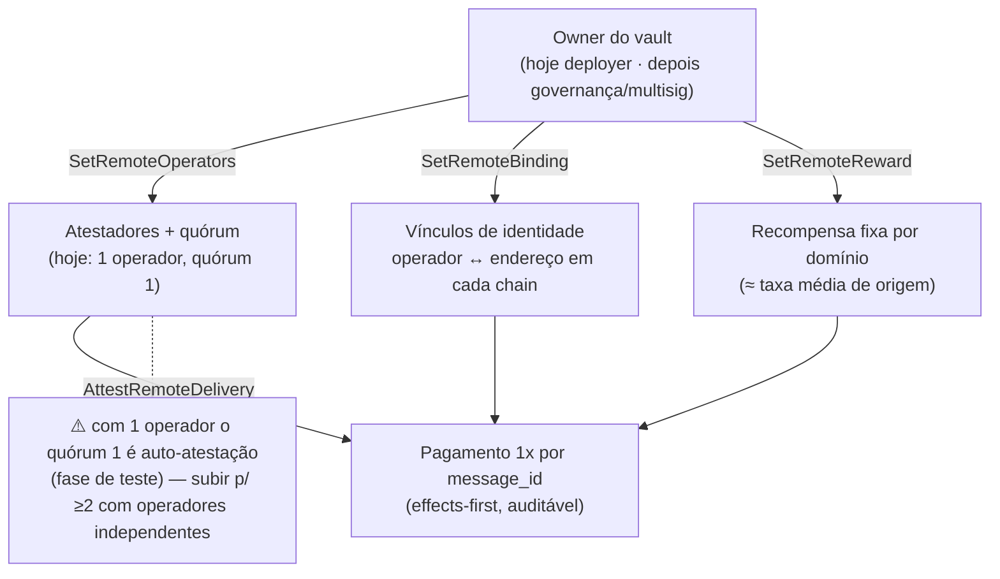
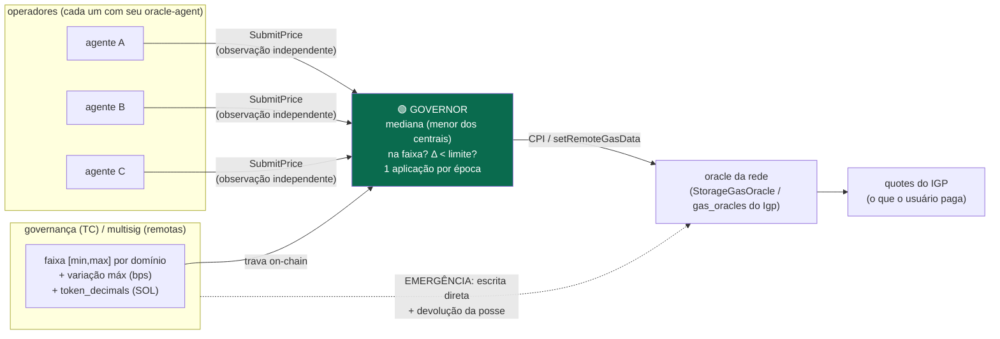
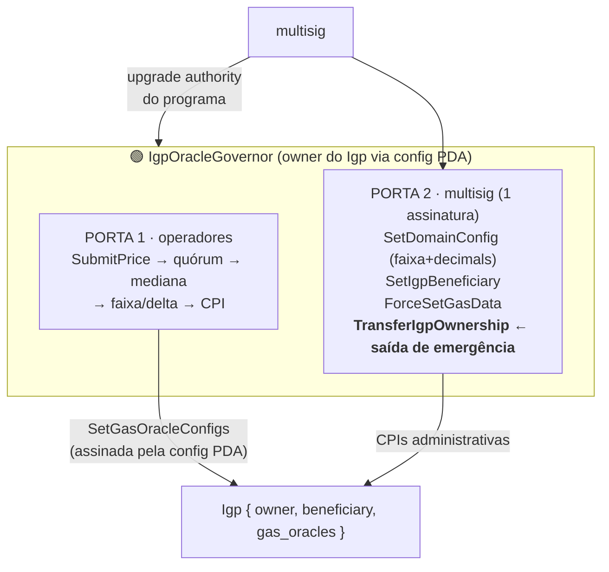

# Arquitetura — visão do todo

Diagramas do sistema completo: o processo Hyperlane de ponta a ponta e onde a
camada de remuneração (este repositório) se encaixa. Os diagramas renderizam no
GitHub (Mermaid). Detalhes normativos: `SPEC.html`.

---

## 1. Visão geral — as 4 redes e as duas camadas

O **core Hyperlane** (azul) não é modificado; a **camada de remuneração**
(verde) só muda configuração: o `beneficiary` de cada IGP vira o Vault e, em
Solana, o `owner` do IGP vira o governor.

---

## 2. O processo Hyperlane completo (com a remuneração acoplada)

Uma transferência TC → BSC, do dispatch ao saque do relayer — os passos 1–8 são
o **core inalterado**; 9–11 são a **camada nova**:

O caminho de volta (BSC → TC) é espelhado: o usuário paga BNB no IGP da BSC, o
relayer gasta LUNC no `process()` do TC e saca do **Vault do TC** — cada rede
se sustenta na própria moeda (spec §05).

---

## 3. Fluxo do dinheiro (autofinanciado por construção)

Sem uso → sem arrecadação, mas também sem trabalho. Tarifa < arrecadação média
por entrega ⇒ o pool nunca fica insolvente (spec §01/§05).

**v2 (ClaimRemote):** o pool da rede de ORIGEM também paga a taxa da mensagem ao
operador que a entregou NUMA OUTRA rede — via atestação com quórum (diagrama 4b):

---

## 4. Prova de entrega — os três mecanismos

```mermaid
flowchart TB
    subgraph P1["TERRA CLASSIC · prova por raw query"]
        A1["Relayer chama Vault::Claim{ids}"] --> B1["raw query: chave<br/>[0x00,0x0A]+'deliveries'+id"]
        B1 --> C1{"valor parseia<br/>{sender, block_number}?"}
        C1 -- "não" --> D1["⛔ MailboxLayoutMismatch<br/>(migrate detectado — nunca paga errado)"]
        C1 -- "sim" --> E1{"sender == relayer?<br/>dentro da janela?<br/>não pago ainda?"}
        E1 -- "sim (TODOS os ids)" --> F1["💰 BankMsg (lote atômico)"]
        E1 -- "não" --> G1["⛔ reverte o LOTE inteiro"]
    end

    subgraph P2["BSC/ETHEREUM · prova direta"]
        A2["claim(ids)"] --> B2["mailbox.processor(id) == msg.sender?<br/>processedAt(id)+janela ≥ bloco?"]
        B2 -- sim --> C2["💰 transfer nativo (atômico, reentrancy-guard)"]
    end

    subgraph P4["QUALQUER ORIGEM · v2 ClaimRemote (atestação de entrega REMOTA)"]
        A4["claim-agent verifica a entrega<br/>na chain de DESTINO"] --> B4["AttestRemoteDelivery{domínio, ids}<br/>no vault da chain de ORIGEM"]
        B4 --> C4{"atestador registrado?<br/>vínculo (operador,domínio)?<br/>id nunca pago?"}
        C4 -- sim --> D4{"atestações CONCORDANTES<br/>≥ quórum?"}
        D4 -- sim --> E4["💰 recompensa fixa do domínio<br/>ao operador vinculado (1x por id)"]
        D4 -- "ainda não" --> F4["atestação registrada,<br/>aguarda quórum (auditável)"]
        C4 -- não --> G4["⛔ reverte"]
    end

    subgraph P3["SOLANA · quórum por época (a chain não registra o executor)"]
        A3["Época de 6h fecha<br/>(+ folga de finalidade)"] --> B3["cada operador submete o relatório:<br/>janela + créditos ORDENADOS por chave"]
        B3 --> C3{"hashes idênticos<br/>≥ quórum?"}
        C3 -- sim --> D3["créditos atribuídos por operador<br/>(PDA OperatorCredit)"]
        C3 -- "divergência" --> E3["🚨 época travada — alarme,<br/>auditoria pública dos relatórios"]
        D3 --> F3["Withdraw: débito de lamports<br/>do pool (respeita rent-exempt)"]
    end
```

---

## 5. Organograma de governança (spec §04)

Três esferas com escopos que não se sobrepõem — o operacional com quem opera, o
estrutural com quem tem mandato:

> ⚠️ O risco nº 1 do projeto mora aqui: quem controla o **ISM do Warp remoto**
> tem acesso indireto ao colateral do TC (cunhar sintético sem lastro → queimar
> → mensagem legítima libera colateral). Por isso o multisig **nunca** pode ser
> composto só pelos validadores que assinam checkpoints, e a troca de ISM pede
> timelock (spec §12).

---

### 5b. ClaimRemote — quem controla o quê (v2)

## 6. Oracle de preço — o mesmo padrão nas 4 redes

O conflito de interesse (operadores controlam o preço que financia a própria
remuneração) é neutralizado porque a **faixa é definida por quem não opera**.

---

## 7. Solana — as duas portas do IgpOracleGovernor

Em Solana o oracle vive DENTRO do `Igp` e só o owner escreve — o governor vira
o owner e reconstrói a separação de poderes:

A separação passa a ser **lógica** (código do governor), não criptográfica —
por isso as três obrigações da spec §08: `TransferIgpOwnership` testada antes
do deploy (✅ testada em `svm/.../tests`), lamports mantidos na config PDA, e
upgrade authority no multisig.
