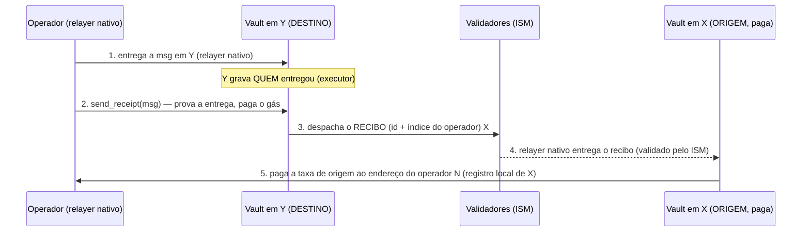

# Prova de Entrega (Proof-of-Delivery) — Guia do Operador, Validador e da Comunidade

> Documento único e completo do sistema que **remunera quem entrega mensagens
> Hyperlane** entre Terra Classic, BSC, Ethereum e Solana. Somos descentralizados:
> qualquer pessoa roda o **relayer/validador nativo do Hyperlane** (sem alteração)
> e recebe pela entrega, de forma **trustless** (sem confiar em ninguém).

Índice:
1. [O que é e por que existe](#1-o-que-é-e-por-que-existe)
2. [Arquitetura](#2-arquitetura)
3. [O modelo de recibo (como você é pago)](#3-o-modelo-de-recibo-como-você-é-pago)
4. [Endereços de todas as chains](#4-endereços-de-todas-as-chains)
5. [Conversão de endereços para hex (comandos locais)](#5-conversão-de-endereços-para-hex-comandos-locais)
6. [Operador — passo a passo para ganhar](#6-operador--passo-a-passo-para-ganhar)
7. [Validador](#7-validador)
8. [Segurança — por que é trustless](#8-segurança--por-que-é-trustless)
9. [Referência rápida de comandos](#9-referência-rápida-de-comandos)

---

## 1. O que é e por que existe

O **Hyperlane** move mensagens entre chains. Quem faz a mensagem chegar do outro
lado é o **relayer** (operador), que **paga o gás** da entrega no destino. Hoje esse
trabalho normalmente não é remunerado de forma justa e verificável.

Este sistema resolve isso: para cada mensagem entregue, a **chain de origem paga a
taxa de origem ao operador que de fato entregou** — provado on-chain, sem
intermediário de confiança. O operador roda **só o relayer nativo do Hyperlane, sem
nenhuma alteração**, e reivindica o pagamento.

Princípios (não-negociáveis):
- **Nenhum contrato nativo do Hyperlane é alterado** (Mailbox, ISM, IGP, warp).
- **Nenhum relayer customizado.** O operador roda o relayer/validador nativo.
- **Trustless.** Ninguém decide "quem recebe" fora da chain; a prova é on-chain e
  passa pelos validadores.

---

## 2. Arquitetura

### 2.1 Chains e domínios Hyperlane
| Chain | Domínio | Tipo |
|---|---|---|
| Terra Classic (TC) | `132556` | CosmWasm |
| BSC | `56` | EVM |
| Ethereum | `1` | EVM |
| Solana | `1399811149` | SVM (Sealevel) |

### 2.2 Peças (nativas — NÃO tocamos)
- **Mailbox** — despacha (origem) e entrega/processa (destino) mensagens.
- **ISM** (Interchain Security Module) — verifica as assinaturas dos **validadores**
  antes de aceitar uma mensagem no destino.
- **IGP** (Interchain Gas Paymaster) — mede/cobra a taxa de gás da entrega.
- **Warp route** — os tokens (ex.: IGORFAKE) que trafegam entre as chains.

### 2.3 Nosso contrato (o "vault") — um por chain
Um contrato nosso em cada chain, com **dois papéis** conforme a direção da mensagem:
- **Papel ORIGEM** (mensagens que saíram daquela chain): guarda o **pool** de
  recompensas, recebe o **recibo** de volta e **paga** o operador.
- **Papel DESTINO** (mensagens entregues naquela chain): **prova a entrega** on-chain
  e **despacha o recibo** de volta para a origem.

Nomes por chain: TC/BSC/ETH = `RelayerRewardVault`; Solana = `pod` (funde vault +
governor num programa só para economizar rent).

### 2.4 Registro "de/para" global de operadores
Cada operador é **uma identidade = um índice** (`u32`), com **um endereço por
chain**. O recibo carrega o **índice** (não o endereço); cada chain resolve o
endereço de pagamento no **seu próprio registro** (definido pelo owner). Assim, nem
um recibo malformado desvia pagamento.

```
operador 0 →  TC: terra1run…   ·  Solana: BirXd4Q…   ·  BSC: 0x8f08…   ·  ETH: 0x…
operador 1 →  …
```

---

## 3. O modelo de recibo (como você é pago)

Fluxo para uma mensagem que vai de **X → Y** (origem X paga; entrega em Y):



Pontos-chave:
- **O domínio de origem é lido da própria mensagem** (comprometido pelo `message_id`)
  — não é palpite.
- **1 pagamento por id** (idempotência) — nunca paga duas vezes.
- **Operador paga o gás do recibo** (recupera na recompensa; por isso vale juntar
  vários ids num recibo só — *batching*).

### 3.1 Solana — só o sentido **Solana → TC**
A Solana tem uma limitação: o Mailbox dela **não grava quem entregou** uma mensagem
(o registro de entrega só tem id/sequência/slot, sem o executor). Por isso:

| Sentido | Dá sem keeper (relayer nativo)? |
|---|---|
| **Solana → TC** | ✅ **SIM** — entrega no TC, que grava o executor |
| **TC → Solana** | ❌ Não — exigiria um relayer customizado (keeper). **Fora do escopo.** |

No Solana→TC, o pagamento cai numa **PDA do operador** (`operator_sol(index)`) e o
operador **saca** depois (o Mailbox nativo não permite pagar direto numa carteira ao
entregar). A idempotência mora no `send_receipt` do TC.

**Status: PROVADO EM PRODUÇÃO (2026-08-19).** Corredores TC↔BSC (2 sentidos) e
Solana→TC funcionando. Detalhes técnicos: `RECIBO-TRUSTLESS.md`.

---

## 4. Endereços de todas as chains

> **Regra de ouro:** o **roteamento/registro** entre chains sempre usa a forma de
> **32 bytes em hex** (`0x` + 64 caracteres). A forma "nativa" (terra1…/0x…/base58) é
> a que você usa nos comandos de cada chain. A §5 ensina a converter.

### 4.1 Terra Classic (domínio 132556) — CosmWasm
| Item | Endereço nativo | 32 bytes (hex) |
|---|---|---|
| Vault (`RelayerRewardVault`) | `terra1gqkrh2va5mqdrlp90ez6lc2hgagxqju6fc7md4kldlz8lap9w4usduzc2q` | `0x402c3ba99da6c0d1fc257e45afe1574750604b9a4e3db6d6df6fc47ff4257579` |
| Mailbox | `terra1fwg35n5esjgny7d8pxnz8usjpwsvpguk0txsy6cnqxy58x9fdlksjpx3p9` | — |
| IGP | `terra1taunhg629rssf3g939nqr0h594q5mssrzdj5lkx2hygmxmh72ghqeqqnvz` | — |
| Vault `code_id` | `11594` | wasm sha256 `cb753ed7aaa136342e4f685e85b8323e9947965c06ada8f4dbb04662563f19bd` |
| RPC | `https://rpc.terra-classic.hexxagon.io:443` · chain-id `columbus-5` · denom `uluna` | |

### 4.2 Solana (domínio 1399811149) — SVM
| Item | Endereço nativo (base58) | 32 bytes (hex) |
|---|---|---|
| Programa `pod` (vault) | `2mQZcHYLFCXL1XnmmQdgCinYZW7yvuksqrdoHmNfZUFj` | `0x1a3be2685e7a787a1bedadcc90889b367f8fe72240de5aa43e4c2b88d07776a2` |
| Config PDA (o **pool**) | `Eq1mJGTSbLb8s6gfoyg5aovxFAhXpnVudXXSAmbDwb9w` | — |
| Governor config PDA | `4sZAfqDqEmR7LMWjrdNmoEkv8S6BDdnDkh5mfADenaaA` | — |
| Mailbox (nativo) | `E588QtVUvresuXq2KoNEwAmoifCzYGpRBdHByN9KQMbi` | — |
| ISM do warp (recibos do TC) | `4MzF7HCfxuwj4EFHqZSEpvkcZZvv1mF37DP4pDHwR5VQ` | — |
| RPC | `https://api.mainnet-beta.solana.com` | |

### 4.3 BSC (domínio 56) — EVM
| Item | Endereço | 32 bytes (hex, left-pad) |
|---|---|---|
| Vault (recibo) | `0x34E06a7793877EC5251b1dC230aD7cD577d231f4` | `0x00000000000000000000000034e06a7793877ec5251b1dc230ad7cd577d231f4` |
| ISM do warp (recibos do TC) | `0xa82087B8eea0394B1476f716B91c10531025Ef42` | |
| RPC | `https://bsc-dataseed.bnbchain.org` | |

### 4.4 Ethereum (domínio 1) — EVM
| Item | Endereço | Observação |
|---|---|---|
| ISM do warp | `0xDe8edEC7207e2dEf9D347Eaa1f6Ee50420bc070b` | vault de recibo **ainda não deployado** (aguardando gás baixo) |

---

## 5. Conversão de endereços para hex (comandos locais)

Você vai precisar do **hex de 32 bytes** ao registrar routers/de-para entre chains.
Rode **na sua máquina** (não precisa de node/chave pra converter):

### 5.1 Terra (`terra1…`) → hex de 32 bytes
```bash
terrad debug addr terra1gqkrh2va5mqdrlp90ez6lc2hgagxqju6fc7md4kldlz8lap9w4usduzc2q
# saída: "Address (hex): 402C3BA9…"  → prefixe com 0x e use minúsculo:
#        0x402c3ba99da6c0d1fc257e45afe1574750604b9a4e3db6d6df6fc47ff4257579
```
> Contratos CosmWasm dão 32 bytes (o que queremos). Contas de usuário dão 20 bytes.

### 5.2 Solana (base58) → hex de 32 bytes
Com Node (qualquer projeto com `@solana/web3.js`, ex.: a pasta `deploy/`):
```bash
node -e 'import("@solana/web3.js").then(({PublicKey})=>console.log("0x"+Buffer.from(new PublicKey("2mQZcHYLFCXL1XnmmQdgCinYZW7yvuksqrdoHmNfZUFj").toBytes()).toString("hex")))'
# → 0x1a3be2685e7a787a1bedadcc90889b367f8fe72240de5aa43e4c2b88d07776a2
```
Sem Node (Python):
```bash
python3 -c 'import base58,sys;print("0x"+base58.b58decode(sys.argv[1]).hex())' 2mQZcHYLFCXL1XnmmQdgCinYZW7yvuksqrdoHmNfZUFj
```

### 5.3 EVM (`0x…` de 20 bytes) → bytes32 (left-pad)
Com Foundry (`cast`):
```bash
cast to-uint256 0x34E06a7793877EC5251b1dC230aD7cD577d231f4
# → 0x00000000000000000000000034e06a7793877ec5251b1dc230ad7cd577d231f4
```
Sem Foundry (manual): `0x` + 24 zeros + os 40 hex do endereço (minúsculo).

### 5.4 Voltar (hex 32B → nativo)
- **Terra:** `terrad debug addr <hex>` também aceita hex e imprime o `Bech32 Acc`.
- **Solana:** `node -e 'console.log(new (require("@solana/web3.js").PublicKey)(Buffer.from("<hex_sem_0x>","hex")).toBase58())'`
- **EVM:** os últimos 40 hex do bytes32 são o endereço.

---

## 6. Operador — passo a passo para ganhar

### 6.0 Pré-requisitos
1. **Rode o relayer nativo do Hyperlane** (sem alteração) para as rotas que quer
   servir. É ele que entrega as mensagens e, depois, os recibos.
2. **Peça ao owner do vault para te registrar** no de/para (você recebe um **índice**
   e informa seu endereço em cada chain). Registro (feito pelo owner):
   ```bash
   # TC: índice N → seu endereço no TC (também vira o reverse-lookup do executor)
   terrad tx wasm execute <VAULT_TC> \
     '{"set_operator_address":{"index":N,"domain":132556,"address":"terra1SEU…"}}' \
     --from <owner> --keyring-backend file --gas auto --gas-adjustment 1.5 \
     --gas-prices 28.325uluna --chain-id columbus-5 \
     --node https://rpc.terra-classic.hexxagon.io:443 -y
   # Solana: índice N → sua carteira Solana (onde o SOL será creditado/sacado)
   OP_INDEX=N OP_WALLET=<SUA_CARTEIRA_BASE58> node deploy/rrv-receipt-config-solana.mjs
   ```

### 6.1 Corredor Solana → TC (ganhar a taxa de origem, provado)

**a) Entregue** mensagens Solana→TC com seu relayer nativo (fluxo normal).

**b) Pegue o hex da mensagem** que você entregou. A mensagem completa está no seu
próprio tx de `process` no Mailbox do TC:
```bash
NODE=https://rpc.terra-classic.hexxagon.io:443
terrad q tx <HASH_DO_SEU_PROCESS> --node $NODE --output json \
 | python3 -c 'import json,sys;t=json.load(sys.stdin);[print(m["msg"]["process"]["message"]) for m in t["tx"]["body"]["messages"] if "process" in m.get("msg",{})]'
```
(As entregas de origem Solana têm os bytes `[5..9]` = `1399811149`.)

**c) Emita o recibo no TC** (pode juntar vários — *batching*):
```bash
terrad tx wasm execute terra1gqkrh2va5mqdrlp90ez6lc2hgagxqju6fc7md4kldlz8lap9w4usduzc2q \
  '{"send_receipt":{"messages":["<MSG_HEX_1>","<MSG_HEX_2>"]}}' \
  --amount 10000000uluna --from <SUA_CHAVE_TC> --keyring-backend file \
  --gas auto --gas-adjustment 1.5 --gas-prices 28.325uluna \
  --chain-id columbus-5 --node https://rpc.terra-classic.hexxagon.io:443 -y --output json
```
> `--amount` paga o IGP do TC→Solana (o recibo é uma mensagem de volta). 10 LUNC cobre com folga.

**d) O relayer nativo entrega o recibo no `pod`** → credita sua PDA. Confira:
```bash
# sua PDA operator_sol(N): (troque o N no seed)
node -e 'import("@solana/web3.js").then(async w=>{const c=new w.Connection("https://api.mainnet-beta.solana.com");const u=n=>{const b=Buffer.alloc(4);b.writeUInt32LE(n);return b};const [p]=w.PublicKey.findProgramAddressSync([Buffer.from("rrv"),Buffer.from("-"),Buffer.from("opsol"),Buffer.from("-"),u(0)],new w.PublicKey("2mQZcHYLFCXL1XnmmQdgCinYZW7yvuksqrdoHmNfZUFj"));console.log(p.toBase58(),await c.getBalance(p),"lamports")})'
```

**e) Saque** (assina com a carteira registrada; sua chave, não a do owner):
```bash
SOLANA_OP_KEYPAIR=/caminho/da/SUA_carteira.json \
  node deploy/rrv-withdraw-operator.mjs N all
```

### 6.2 Corredores TC↔BSC / TC↔ETH (EVM)
Mesmo modelo, espelhado. No **DESTINO** você chama `sendReceipt`; na **ORIGEM** o
pagamento é automático quando o recibo chega. Ver `RECIBO-TRUSTLESS.md` §B/§C
(comandos `cast`/`terrad` completos). ETH aguarda o deploy do vault (gás baixo).

---

## 7. Validador

Os **validadores** são o que torna o recibo confiável: eles assinam as raízes das
mensagens; o **ISM** do destino só aceita um recibo se o quórum de validadores
assinou. Ou seja, **a segurança do pagamento depende da rede de validadores** — não
de nenhum servidor central.

- Rode o **validador nativo do Hyperlane** (sem alteração) para as chains que assina.
- Suas assinaturas ficam num store público (S3/GCS) que os relayers leem.
- Quanto mais validadores independentes, mais forte o ISM (e mais difícil forjar
  qualquer entrega/recibo).
- Você **não** precisa rodar nada deste projeto: o vault/pod usa o **mesmo ISM do
  warp** que você já valida. Validar o warp = validar os recibos daquela rota.

---

## 8. Segurança — por que é trustless

- **Prova on-chain de entrega.** O recibo só nasce se a entrega foi provada no
  destino (o Mailbox registra a entrega); ninguém "declara" que entregou.
- **Validado pelo ISM na volta.** O recibo é uma mensagem Hyperlane comum — passa
  pelos validadores/ISM antes de a origem aceitar. Recibo forjado é rejeitado.
- **Origem lida da mensagem.** O domínio de origem vem dos bytes da mensagem
  (comprometidos pelo `message_id`), não dá para desviar para o pool de outra chain.
- **Router registrado.** A origem só aceita `handle`/recibo vindo do **vault
  registrado** da chain de destino (allowlist). Sender diferente = rejeitado.
- **Pagamento por índice + registro local.** O recibo carrega o **índice** do
  operador; cada chain paga o endereço de N no **seu próprio registro** (definido
  pelo owner). Recibo malformado não redireciona fundos.
- **1 pagamento por id (idempotência).** No EVM/CW existe no lado que paga; na Solana
  (que não deduplica no `handle`) a idempotência mora no `send_receipt` do TC. O
  Mailbox ainda garante entrega única por mensagem.
- **Nada nativo é alterado; nenhum relayer customizado.** Menos superfície de ataque:
  um relayer malicioso não muda quem recebe — quem decide é o contrato + os validadores.

---

## 9. Referência rápida de comandos

```bash
# --- CONVERSÕES (locais) ---
terrad debug addr terra1…                       # Terra → hex 32B ("Address (hex)")
node -e 'import("@solana/web3.js").then(({PublicKey})=>console.log("0x"+Buffer.from(new PublicKey("BASE58").toBytes()).toString("hex")))'
cast to-uint256 0xADDR                           # EVM → bytes32 (left-pad)

# --- OPERADOR (Solana→TC) ---
# 1. pegar o hex da mensagem entregue:
terrad q tx <HASH> --node https://rpc.terra-classic.hexxagon.io:443 --output json \
 | python3 -c 'import json,sys;t=json.load(sys.stdin);[print(m["msg"]["process"]["message"]) for m in t["tx"]["body"]["messages"] if "process" in m.get("msg",{})]'
# 2. emitir recibo no TC:
terrad tx wasm execute terra1gqkrh2va5mqdrlp90ez6lc2hgagxqju6fc7md4kldlz8lap9w4usduzc2q \
  '{"send_receipt":{"messages":["<MSG_HEX>"]}}' --amount 10000000uluna \
  --from <SUA_CHAVE> --keyring-backend file --gas auto --gas-adjustment 1.5 \
  --gas-prices 28.325uluna --chain-id columbus-5 \
  --node https://rpc.terra-classic.hexxagon.io:443 -y
# 3. sacar na Solana:
SOLANA_OP_KEYPAIR=/caminho/carteira.json node deploy/rrv-withdraw-operator.mjs 0 all

# --- CONSULTAS ---
terrad q wasm contract-state smart <VAULT_TC> '{"config":{}}' --node https://rpc.terra-classic.hexxagon.io:443
terrad q wasm contract-state smart <VAULT_TC> '{"remote_router":{"domain":1399811149}}' --node https://rpc.terra-classic.hexxagon.io:443
solana balance <CONFIG_PDA> -u https://api.mainnet-beta.solana.com   # saldo do pool
```

---

*Documento vivo. Provas on-chain e detalhes de implementação: `RECIBO-TRUSTLESS.md`.
Endereços dos warps IGORFAKE por chain: `WARP-IGORFAKE.md`. Auditoria por chain:
`AUDITORIA-{TC,BSC,ETH,SOLANA}.md`.*
