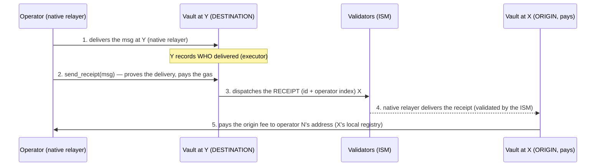

# Proof-of-Delivery — Operator, Validator and Community Guide

> A single, complete document of the system that **rewards whoever delivers
> Hyperlane messages** between Terra Classic, BSC, Ethereum and Solana. We are
> decentralized: anyone runs the **native Hyperlane relayer/validator** (with no
> changes) and gets paid for the delivery, **trustlessly** (without trusting
> anyone).

Index:
1. [What it is and why it exists](#1-what-it-is-and-why-it-exists)
2. [Architecture](#2-architecture)
3. [The receipt model (how you get paid)](#3-the-receipt-model-how-you-get-paid)
4. [Addresses of all chains](#4-addresses-of-all-chains)
5. [Converting addresses to hex (local commands)](#5-converting-addresses-to-hex-local-commands)
6. [Operator — step by step to earn](#6-operator--step-by-step-to-earn)
   · [6.3 Add a new operator](#63-add-a-new-operator-onboarding)
7. [Validator](#7-validator)
8. [Security — why it is trustless](#8-security--why-it-is-trustless)
9. [Quick command reference](#9-quick-command-reference)

---

## 1. What it is and why it exists

**Hyperlane** moves messages between chains. The one who makes the message arrive
on the other side is the **relayer** (operator), who **pays the gas** of the
delivery at the destination. Today this work is usually not rewarded in a fair
and verifiable way.

This system solves that: for each delivered message, the **origin chain pays the
origin fee to the operator who actually delivered it** — proven on-chain, with no
trusted intermediary. The operator runs **only the native Hyperlane relayer, with
no changes**, and claims the payment.

Principles (non-negotiable):
- **No native Hyperlane contract is changed** (Mailbox, ISM, IGP, warp).
- **No custom relayer.** The operator runs the native relayer/validator.
- **Trustless.** Nobody decides "who gets paid" off-chain; the proof is on-chain
  and goes through the validators.

---

## 2. Architecture

### 2.1 Hyperlane chains and domains
| Chain | Domain | Type |
|---|---|---|
| Terra Classic (TC) | `132556` | CosmWasm |
| BSC | `56` | EVM |
| Ethereum | `1` | EVM |
| Solana | `1399811149` | SVM (Sealevel) |

### 2.2 Pieces (native — we do NOT touch them)
- **Mailbox** — dispatches (origin) and delivers/processes (destination) messages.
- **ISM** (Interchain Security Module) — verifies the **validators'** signatures
  before accepting a message at the destination.
- **IGP** (Interchain Gas Paymaster) — measures/charges the delivery gas fee.
- **Warp route** — the tokens (e.g., IGORFAKE) that travel between the chains.

### 2.3 Our contract (the "vault") — one per chain
One contract of ours on each chain, with **two roles** depending on the direction
of the message:
- **ORIGIN role** (messages that left that chain): keeps the **pool** of rewards,
  receives the **receipt** back and **pays** the operator.
- **DESTINATION role** (messages delivered on that chain): **proves the delivery**
  on-chain and **dispatches the receipt** back to the origin.

Names per chain: TC/BSC/ETH = `RelayerRewardVault`; Solana = `pod` (merges vault +
governor into a single program to save rent).

### 2.4 Global "from/to" operator registry
Each operator is **one identity = one index** (`u32`), with **one address per
chain**. The receipt carries the **index** (not the address); each chain resolves
the payment address in **its own registry** (set by the owner). This way, not even
a malformed receipt diverts payment.

```
operator 0 →  TC: terra1run…   ·  Solana: BirXd4Q…   ·  BSC: 0x8f08…   ·  ETH: 0x…
operator 1 →  …
```

---

## 3. The receipt model (how you get paid)

Flow for a message that goes from **X → Y** (origin X pays; delivery at Y):



Key points:
- **The origin domain is read from the message itself** (committed by the
  `message_id`) — it is not a guess.
- **1 payment per id** (idempotency) — never pays twice.
- **Operator pays the gas of the receipt** (recovered in the reward; that is why
  it is worth batching several ids into a single receipt — *batching*).

### 3.1 Solana — only the **Solana → TC** direction
Solana has a limitation: its Mailbox **does not record who delivered** a message
(the delivery record only has id/sequence/slot, without the executor). Because of
this:

| Direction | Works without a keeper (native relayer)? |
|---|---|
| **Solana → TC** | ✅ **YES** — delivery on TC, which records the executor |
| **TC → Solana** | ❌ No — would require a custom relayer (keeper). **Out of scope.** |

In Solana→TC, the payment lands in an **operator PDA** (`operator_sol(index)`) and
the operator **withdraws** later (the native Mailbox does not allow paying
directly into a wallet on delivery). Idempotency lives in TC's `send_receipt`.

**Status: PROVEN IN PRODUCTION (2026-08-19).** TC↔BSC corridors (both directions)
and Solana→TC working. Technical details: `TRUSTLESS-RECEIPT.md`.

---

## 4. Addresses of all chains

> **Golden rule:** the cross-chain **routing/registry** always uses the **32-byte
> hex** form (`0x` + 64 characters). The "native" form (terra1…/0x…/base58) is the
> one you use in each chain's commands. §5 teaches how to convert.

### 4.1 Terra Classic (domain 132556) — CosmWasm
| Item | Native address | 32 bytes (hex) |
|---|---|---|
| Vault (`RelayerRewardVault`) | `terra1gqkrh2va5mqdrlp90ez6lc2hgagxqju6fc7md4kldlz8lap9w4usduzc2q` | `0x402c3ba99da6c0d1fc257e45afe1574750604b9a4e3db6d6df6fc47ff4257579` |
| Mailbox | `terra1fwg35n5esjgny7d8pxnz8usjpwsvpguk0txsy6cnqxy58x9fdlksjpx3p9` | — |
| IGP | `terra1taunhg629rssf3g939nqr0h594q5mssrzdj5lkx2hygmxmh72ghqeqqnvz` | — |
| Vault `code_id` | `11594` | wasm sha256 `cb753ed7aaa136342e4f685e85b8323e9947965c06ada8f4dbb04662563f19bd` |
| RPC | `https://rpc.terra-classic.hexxagon.io:443` · chain-id `columbus-5` · denom `uluna` | |

### 4.2 Solana (domain 1399811149) — SVM
| Item | Native address (base58) | 32 bytes (hex) |
|---|---|---|
| `pod` program (vault) | `2mQZcHYLFCXL1XnmmQdgCinYZW7yvuksqrdoHmNfZUFj` | `0x1a3be2685e7a787a1bedadcc90889b367f8fe72240de5aa43e4c2b88d07776a2` |
| Config PDA (the **pool**) | `Eq1mJGTSbLb8s6gfoyg5aovxFAhXpnVudXXSAmbDwb9w` | — |
| Governor config PDA | `4sZAfqDqEmR7LMWjrdNmoEkv8S6BDdnDkh5mfADenaaA` | — |
| Mailbox (native) | `E588QtVUvresuXq2KoNEwAmoifCzYGpRBdHByN9KQMbi` | — |
| Warp ISM (receipts from TC) | `4MzF7HCfxuwj4EFHqZSEpvkcZZvv1mF37DP4pDHwR5VQ` | — |
| RPC | `https://api.mainnet-beta.solana.com` | |

### 4.3 BSC (domain 56) — EVM
| Item | Address | 32 bytes (hex, left-pad) |
|---|---|---|
| Vault (receipt) | `0x34E06a7793877EC5251b1dC230aD7cD577d231f4` | `0x00000000000000000000000034e06a7793877ec5251b1dc230ad7cd577d231f4` |
| Warp ISM (receipts from TC) | `0xF6b0cDD33A7d2895a3F18b85569Ed9A8278cD151` | mutable (definitive address), 4 validators / threshold 3 — `ISM-VALIDATORS.md` |
| RPC | `https://bsc-dataseed.bnbchain.org` | |

### 4.4 Ethereum (domain 1) — EVM
| Item | Address | Note |
|---|---|---|
| Warp ISM | `0x3ba17675f0D319C89D70722f6eb07790DF0B254B` | mutable (definitive address), 4 validators / threshold 3 — `ISM-VALIDATORS.md`; receipt vault **not yet deployed** (waiting for low gas) |

---

## 5. Converting addresses to hex (local commands)

You will need the **32-byte hex** when registering routers/from-to between chains.
Run **on your own machine** (no node/key needed to convert):

### 5.1 Terra (`terra1…`) → 32-byte hex
```bash
terrad debug addr terra1gqkrh2va5mqdrlp90ez6lc2hgagxqju6fc7md4kldlz8lap9w4usduzc2q
# output: "Address (hex): 402C3BA9…"  → prefix with 0x and use lowercase:
#        0x402c3ba99da6c0d1fc257e45afe1574750604b9a4e3db6d6df6fc47ff4257579
```
> CosmWasm contracts give 32 bytes (what we want). User accounts give 20 bytes.

### 5.2 Solana (base58) → 32-byte hex
With Node (any project with `@solana/web3.js`, e.g., the `deploy/` folder):
```bash
node -e 'import("@solana/web3.js").then(({PublicKey})=>console.log("0x"+Buffer.from(new PublicKey("2mQZcHYLFCXL1XnmmQdgCinYZW7yvuksqrdoHmNfZUFj").toBytes()).toString("hex")))'
# → 0x1a3be2685e7a787a1bedadcc90889b367f8fe72240de5aa43e4c2b88d07776a2
```
Without Node (Python):
```bash
python3 -c 'import base58,sys;print("0x"+base58.b58decode(sys.argv[1]).hex())' 2mQZcHYLFCXL1XnmmQdgCinYZW7yvuksqrdoHmNfZUFj
```

### 5.3 EVM (20-byte `0x…`) → bytes32 (left-pad)
With Foundry (`cast`):
```bash
cast to-uint256 0x34E06a7793877EC5251b1dC230aD7cD577d231f4
# → 0x00000000000000000000000034e06a7793877ec5251b1dc230ad7cd577d231f4
```
Without Foundry (manual): `0x` + 24 zeros + the 40 hex chars of the address
(lowercase).

### 5.4 Back (32B hex → native)
- **Terra:** `terrad debug addr <hex>` also accepts hex and prints the `Bech32 Acc`.
- **Solana:** `node -e 'console.log(new (require("@solana/web3.js").PublicKey)(Buffer.from("<hex_sem_0x>","hex")).toBase58())'`
- **EVM:** the last 40 hex chars of the bytes32 are the address.

---

## 6. Operator — step by step to earn

### 6.0 Prerequisites
1. **Run the native Hyperlane relayer** (with no changes) for the routes you want
   to serve. It is the relayer that delivers the messages and, later, the
   receipts.
2. **Be registered in the from/to** (you receive an **index** and provide your
   address on each chain). Registration is done by the **owner** — full step by
   step in [§6.3 Add a new operator](#63-add-a-new-operator-onboarding).

### 6.1 Solana → TC corridor (earn the origin fee, proven)

**a) Deliver** Solana→TC messages with your native relayer (normal flow).

**b) Grab the hex of the message** you delivered. The complete message is in your
own `process` tx on the TC Mailbox:
```bash
NODE=https://rpc.terra-classic.hexxagon.io:443
terrad q tx <HASH_DO_YOUR_PROCESS> --node $NODE --output json \
 | python3 -c 'import json,sys;t=json.load(sys.stdin);[print(m["msg"]["process"]["message"]) for m in t["tx"]["body"]["messages"] if "process" in m.get("msg",{})]'
```
(Solana-origin deliveries have bytes `[5..9]` = `1399811149`.)

**c) Emit the receipt on TC** (you can batch several — *batching*):
```bash
terrad tx wasm execute terra1gqkrh2va5mqdrlp90ez6lc2hgagxqju6fc7md4kldlz8lap9w4usduzc2q \
  '{"send_receipt":{"messages":["<MSG_HEX_1>","<MSG_HEX_2>"]}}' \
  --amount 10000000uluna --from <YOUR_KEY_TC> --keyring-backend file \
  --gas auto --gas-adjustment 1.5 --gas-prices 28.325uluna \
  --chain-id columbus-5 --node https://rpc.terra-classic.hexxagon.io:443 -y --output json
```
> `--amount` pays the TC→Solana IGP (the receipt is a message going back). 10 LUNC covers it with room to spare.

**d) The native relayer delivers the receipt to the `pod`** → credits your PDA.
Check:
```bash
# your operator_sol(N) PDA: (change the N in the seed)
node -e 'import("@solana/web3.js").then(async w=>{const c=new w.Connection("https://api.mainnet-beta.solana.com");const u=n=>{const b=Buffer.alloc(4);b.writeUInt32LE(n);return b};const [p]=w.PublicKey.findProgramAddressSync([Buffer.from("rrv"),Buffer.from("-"),Buffer.from("opsol"),Buffer.from("-"),u(0)],new w.PublicKey("2mQZcHYLFCXL1XnmmQdgCinYZW7yvuksqrdoHmNfZUFj"));console.log(p.toBase58(),await c.getBalance(p),"lamports")})'
```

**e) Withdraw** (sign with the registered wallet; your key, not the owner's):
```bash
SOLANA_OP_KEYPAIR=/path/to/your_wallet.json \
  node deploy/rrv-withdraw-operator.mjs N all
```

### 6.2 TC↔BSC / TC↔ETH corridors (EVM)
Same model, mirrored. At the **DESTINATION** you call `sendReceipt`; at the
**ORIGIN** the payment is automatic when the receipt arrives. See
`TRUSTLESS-RECEIPT.md` §B/§C (full `cast`/`terrad` commands). ETH is waiting for
the vault deploy (low gas).

### 6.3 Add a new operator (onboarding)

> Done by the **owner** of the vault. The operator itself installs nothing beyond
> the native relayer — it just needs to be registered.

**Concept:** an operator is **ONE identity = ONE global index `N`** (`u32`), with
**one address per chain**. For each chain it will serve, the owner registers the
**operator's address ON THAT chain, under the same index `N`**, using **that
chain's own domain**. This registration does **two things at once**:
- **payment** — when that chain is ORIGIN, it pays this address;
- **delivery recognition** (reverse-lookup) — when that chain is DESTINATION, the
  `send_receipt` figures out "the executor is operator N".

Pick the next free index (`0, 1, 2, …` — coordinate with the team so as not to
repeat). The operator does **not** need to be on the governor's operator list to
earn — the registered address is enough.

**Step by step (register on each chain where the operator will act):**

**① Terra Classic** (domain 132556):
```bash
terrad tx wasm execute terra1gqkrh2va5mqdrlp90ez6lc2hgagxqju6fc7md4kldlz8lap9w4usduzc2q \
  '{"set_operator_address":{"index":N,"domain":132556,"address":"terra1DO_OPERADOR"}}' \
  --from <OWNER> --keyring-backend file --gas auto --gas-adjustment 1.5 \
  --gas-prices 28.325uluna --chain-id columbus-5 \
  --node https://rpc.terra-classic.hexxagon.io:443 -y
```

**② Solana** (domain 1399811149) — registers `operator_sol(N)` (payment) and the
reverse-lookup. `SKIP_REWARD=1` because the reward is already set (avoids
re-running the proposal); the router is rewritten idempotently:
```bash
OP_INDEX=N OP_WALLET=<CARTEIRA_BASE58_DO_OPERADOR> SKIP_REWARD=1 \
  node deploy/rrv-receipt-config-solana.mjs
```

**③ BSC** (domain 56):
```bash
cast send 0x34E06a7793877EC5251b1dC230aD7cD577d231f4 \
  "setOperatorAddress(uint32,uint32,string)" N 56 "0xCARTEIRA_BSC_DO_OPERADOR" \
  --legacy --private-key <OWNER_PK> --rpc-url https://bsc-dataseed.bnbchain.org
```

**④ Ethereum** (domain 1) — *when the ETH vault exists*: same as BSC, swapping the
vault address and `56`→`1`.

**Verification (the reverse-lookup must return N):**
```bash
# TC:
terrad q wasm contract-state smart terra1gqkrh2va5mqdrlp90ez6lc2hgagxqju6fc7md4kldlz8lap9w4usduzc2q \
  '{"operator_of_local":{"address":"terra1DO_OPERADOR"}}' \
  --node https://rpc.terra-classic.hexxagon.io:443
# BSC:
cast call 0x34E06a7793877EC5251b1dC230aD7cD577d231f4 \
  "operatorOfLocal(address)(bool,uint32)" 0xCARTEIRA_BSC --rpc-url https://bsc-dataseed.bnbchain.org
# Solana (the opsol(N) PDA must exist and hold the wallet):
node -e 'import("@solana/web3.js").then(async w=>{const c=new w.Connection("https://api.mainnet-beta.solana.com");const u=n=>{const b=Buffer.alloc(4);b.writeUInt32LE(n);return b};const [p]=w.PublicKey.findProgramAddressSync([Buffer.from("rrv"),Buffer.from("-"),Buffer.from("opsol"),Buffer.from("-"),u(N)],new w.PublicKey("2mQZcHYLFCXL1XnmmQdgCinYZW7yvuksqrdoHmNfZUFj"));console.log("opsol(N):",p.toBase58(),(await c.getAccountInfo(p))?"OK":"ausente")})'
```

Done: from there on the operator delivers with the native relayer and earns
following §6.1 (Solana→TC) / §6.2 (EVM). To **remove** an operator, the owner
rewrites the address as empty (TC/EVM: null `address`/`""`), which zeroes the
reverse-lookup.

---

## 7. Validator

The **validators** are what makes the receipt trustworthy: they sign the roots of
the messages; the destination **ISM** only accepts a receipt if the validator
quorum signed it. In other words, **the security of the payment depends on the
validator network** — not on any central server.

- Run the **native Hyperlane validator** (with no changes) for the chains you sign.
- Your signatures go into a public store (S3/GCS) that the relayers read.
- The more independent validators, the stronger the ISM (and the harder to forge
  any delivery/receipt).
- You do **not** need to run anything from this project: the vault/pod uses the
  **same warp ISM** you already validate. Validating the warp = validating the
  receipts of that route.

---

## 8. Security — why it is trustless

- **On-chain proof of delivery.** The receipt is only born if the delivery was
  proven at the destination (the Mailbox records the delivery); nobody "declares"
  that they delivered.
- **Validated by the ISM on the way back.** The receipt is an ordinary Hyperlane
  message — it goes through the validators/ISM before the origin accepts it. A
  forged receipt is rejected.
- **Origin read from the message.** The origin domain comes from the message bytes
  (committed by the `message_id`), so it cannot be diverted to another chain's
  pool.
- **Registered router.** The origin only accepts a `handle`/receipt coming from
  the destination chain's **registered vault** (allowlist). A different sender =
  rejected.
- **Payment by index + local registry.** The receipt carries the operator's
  **index**; each chain pays N's address in **its own registry** (set by the
  owner). A malformed receipt does not redirect funds.
- **1 payment per id (idempotency).** On EVM/CW it lives on the paying side; on
  Solana (which does not deduplicate in `handle`) idempotency lives in TC's
  `send_receipt`. The Mailbox still guarantees a single delivery per message.
- **Nothing native is changed; no custom relayer.** Less attack surface: a
  malicious relayer does not change who gets paid — the contract + the validators
  decide.

---

## 9. Quick command reference

```bash
# --- CONVERSIONS (local) ---
terrad debug addr terra1…                       # Terra → 32B hex ("Address (hex)")
node -e 'import("@solana/web3.js").then(({PublicKey})=>console.log("0x"+Buffer.from(new PublicKey("BASE58").toBytes()).toString("hex")))'
cast to-uint256 0xADDR                           # EVM → bytes32 (left-pad)

# --- OPERATOR (Solana→TC) ---
# 1. grab the hex of the delivered message:
terrad q tx <HASH> --node https://rpc.terra-classic.hexxagon.io:443 --output json \
 | python3 -c 'import json,sys;t=json.load(sys.stdin);[print(m["msg"]["process"]["message"]) for m in t["tx"]["body"]["messages"] if "process" in m.get("msg",{})]'
# 2. emit the receipt on TC:
terrad tx wasm execute terra1gqkrh2va5mqdrlp90ez6lc2hgagxqju6fc7md4kldlz8lap9w4usduzc2q \
  '{"send_receipt":{"messages":["<MSG_HEX>"]}}' --amount 10000000uluna \
  --from <YOUR_KEY> --keyring-backend file --gas auto --gas-adjustment 1.5 \
  --gas-prices 28.325uluna --chain-id columbus-5 \
  --node https://rpc.terra-classic.hexxagon.io:443 -y
# 3. withdraw on Solana:
SOLANA_OP_KEYPAIR=/path/to/wallet.json node deploy/rrv-withdraw-operator.mjs 0 all

# --- QUERIES ---
terrad q wasm contract-state smart <VAULT_TC> '{"config":{}}' --node https://rpc.terra-classic.hexxagon.io:443
terrad q wasm contract-state smart <VAULT_TC> '{"remote_router":{"domain":1399811149}}' --node https://rpc.terra-classic.hexxagon.io:443
solana balance <CONFIG_PDA> -u https://api.mainnet-beta.solana.com   # pool balance
```

---

*Living document. On-chain proofs and implementation details: `TRUSTLESS-RECEIPT.md`.
IGORFAKE warp addresses per chain: `WARP-IGORFAKE.md`. Audit per chain:
`AUDIT-{TC,BSC,ETH,SOLANA}.md`.*
