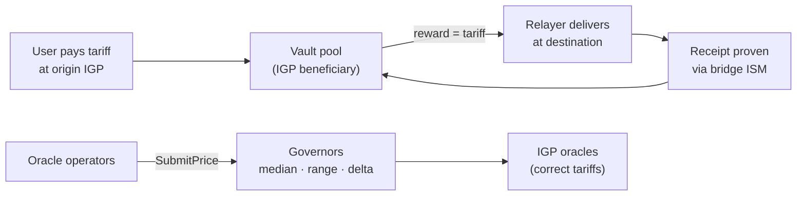

# Consolidated Audit — tc-proof-of-delivery (4 networks)

> Single entry-point audit document: what is deployed on each chain, under which
> hashes, who holds which powers, and how anyone can verify it all independently.
> Last on-chain verification: **2026-08-28**. The companion entry-point document is
> the operator [INSTALL.md](INSTALL.md).

## 1. What the system is

**Proof-of-delivery pays Hyperlane relayers across 4 networks.** Users pay a gas
tariff (~$0.08) at the origin IGP; the IGP's beneficiary is the **vault**, which
holds the pool. When the relayer delivers a message, the destination proves it
(**trustless receipt**, validated by the bridge validators) and the **origin vault
pays the relayer exactly the tariff** (pass-through, never a fixed amount).
Gas prices are kept honest by **governors** fed by independent oracle operators
(median · governance-set ranges · max delta 2000 bps/epoch · epoch 6 h).



## 2. Deployed contracts & hashes (verified on-chain 2026-08-28)

### Terra Classic — `columbus-5`, domain **132556** (collateral side)

| Contract | Address | code_id | data_hash (= reproducible build) |
|---|---|---|---|
| **relayer-reward-vault** | `terra1gqkrh2va5mqdrlp90ez6lc2hgagxqju6fc7md4kldlz8lap9w4usduzc2q` | **11635** | `339b82571a9679830f1b7469a2ae42a96929286d77954f53014416af9bcc33fa` |
| **oracle-governor** | `terra1z7jmlky2cmsd9aslm4uxrsase2yjwz8k9rlk00ga8s7pxgljczjq9sv4hj` | 11587 | `3383e2bc929f0d9907a95567c35ec17f4399dedc5f712b4198c244d039c41744` |
| Mailbox (Hyperlane) | `terra1fwg35n5esjgny7d8pxnz8usjpwsvpguk0txsy6cnqxy58x9fdlksjpx3p9` | 11371 | — |
| IGP (beneficiary = **vault** ✓) | `terra1taunhg629rssf3g939nqr0h594q5mssrzdj5lkx2hygmxmh72ghqeqqnvz` | — | — |
| IGP oracle (owner = **governor** ✓) | `terra1j8xzgzk7vds5uzrplmnln4vcz6f205t9atdyflypzrr43cd5eh7scwqj0d` | — | — |

Vault state (2026-08-28): pool = claims_payable = **13,489.469826 LUNC** (solvent,
`claims_payable == pool` invariant holds), `reward_per_delivery = 1` (symbolic —
the real payment happens at the origin).

**Vault migration record (i18n, 2026-08-28):** code 11596 → **11635**
(2 production error strings translated PT→EN; state fully preserved; reversible):
- store: `0DF2F74B228F28CD80E7C8EE1E828E40BC4AA90F1406C6C667D0831474F492E9`
- migrate: `0472A13D3950A6648950B591CA2D3BCB6D6408B335481159A730B9DF5E1CDC0A`

### BSC — domain **56** (synthetic side)

| Piece | Address |
|---|---|
| **RelayerRewardVault** (trustless receipt, ACTIVE) | `0x34E06a7793877EC5251b1dC230aD7cD577d231f4` |
| **GasOracleGovernor** | `0x5CF7A3a7EA0c264c86a5faf248AfD5EDCd7913E5` |
| Mailbox | `0x2971b9Aec44bE4eb673DF1B88cDB57b96eefe8a4` |
| IGP | `0xEdEd7a4f6FEe4B474B9d7730Bf3465E35E2a4923` |
| Oracle (owner = governor ✓) | `0x7dE950f8F0a037783989a6BE84B3620916552306` |
| deprecated: vault v2 `0x1A41144c…`, v1 `0x8b3A9eEB…` | (unused) |

### Ethereum — domain **1** (synthetic side)

| Piece | Address |
|---|---|
| **RelayerRewardVault v2** (ACTIVE; receipt replication pending) | `0x04096dCBbBB0FA58a312761c38E1d3B9F64631F1` |
| **GasOracleGovernor** | `0xa1803b366af48Cb16E0f44D24B4eb9f58643fEFA` |
| Mailbox | `0xc005dc82818d67AF737725bD4bf75435d065D239` |
| IGP | `0x9650F1f8DB492750323172145e67Df4e89E964Aa` |
| Oracle (owner = governor ✓) | `0x3987cCE8f08037EBF93Ef3a934753540A94196cE` |

EVM contracts are **immutable** (constructor-set, no proxy) — powers are limited to
the explicit owner/operator functions listed below.

### Solana — domain **1399811149** (synthetic side)

| Piece | Address |
|---|---|
| **pod program** (vault + governor merged; 1st instruction byte routes 0=vault/1=governor) | `2mQZcHYLFCXL1XnmmQdgCinYZW7yvuksqrdoHmNfZUFj` |
| `pod.so` sha256 (= mainnet program, byte-verified via `solana program dump`) | `f2f434d8d5256d3deb35d106dbca3adc261a66a7ca77c933edd74dbb3aa8572e` |
| rrv config PDA (the POOL; IGP beneficiary ✓) | `Eq1mJGTSbLb8s6gfoyg5aovxFAhXpnVudXXSAmbDwb9w` |
| gov config PDA (IGP owner ✓) | `4sZAfqDqEmR7LMWjrdNmoEkv8S6BDdnDkh5mfADenaaA` |
| IGP program / Mailbox | `FLZuKRsfdovLqd8n1AYhPCwLqBjfFyZY3A2edgnjdJoR` / `E588QtVUvresuXq2KoNEwAmoifCzYGpRBdHByN9KQMbi` |

Price rounds use **one PDA per domain** (`["gov","-","price","-",domain_le]`) — rent
is paid once, structurally eliminating the 2026-08 rent leak (program fix + agent fix
both in `main`).

## 3. Powers, keys and security model

| Power | Holder | Notes |
|---|---|---|
| TC vault/governor owner + migrate admin | `terra1run9wz09uhh6pu7ggcwwetrgye4wu7wn26mawp` | temporary until governance handoff |
| EVM vault/governor owner & oracle operator | BSC `0x8f085bAD1a15ee9ceeE58C83EFFFa72518975291` · ETH `0xEF8181201Ce6C83120035Ffbcc11945E67Ba00ae` | = per-chain relayer wallets |
| Solana upgrade authority + governor multisig | `BirXd4QDxfq2vx9LGqgXXSgZrjT81rhoFGUbQRWDEf1j` | vault admin actions via proposals |
| Relayer (earns the rewards) | TC `terra1run9wz…` · SOL `PbEo7Fn2eJ6LYa4B8YU4MexB6s1BEQquWKCM1cwwrkS` | tooling runs on a separate wallet |

**Defense in depth.** Oracles: median across operators, governance ranges, max delta
2000 bps/epoch — one bad operator cannot move a price alone. Vaults: solvency
invariant `claims_payable == pool` (checked by tests and monitorable on-chain),
receipts validated by the warp **ISM (4 validators, threshold 3** since 2026-08-20 —
see `../ISM-VALIDATORS.md`), anti-self-payment on ClaimRemote, payment happens
**once, at the origin**. Keys: only via environment variables, never in configs.

## 4. Reproduce every hash yourself

```bash
git clone https://github.com/terra-classic-hyperlane/proof-of-delivery && cd proof-of-delivery

# Terra Classic (CosmWasm) — reproducible build
docker run --rm -v "$(pwd)":/code -v cwopt_cache:/target \
  -v cwopt_registry:/usr/local/cargo/registry cosmwasm/optimizer:0.17.0
cat artifacts/checksums.txt
curl -s https://lcd.terra-classic.hexxagon.io/cosmwasm/wasm/v1/code/11635 | jq -r .code_info.data_hash  # vault
curl -s https://lcd.terra-classic.hexxagon.io/cosmwasm/wasm/v1/code/11587 | jq -r .code_info.data_hash  # governor

# Solana — compare your build with the live program byte by byte
cd svm && cargo build-sbf && sha256sum target/deploy/pod.so
solana program dump 2mQZcHYLFCXL1XnmmQdgCinYZW7yvuksqrdoHmNfZUFj /tmp/pod_onchain.so -u mainnet-beta
head -c $(stat -c%s target/deploy/pod.so) /tmp/pod_onchain.so | sha256sum   # must match

# EVM — full test suite (contracts are immutable; bytecode analysis in ../I18N-AUDIT-REPORT.md §2b)
cd ../evm && forge test    # 48/48
```

Test suites (all green, 2026-08-28): CosmWasm 15+4+34 · Solana 6+17 · EVM 48.

## 5. Related records

- `../I18N-AUDIT-REPORT.md` — full PT→EN translation record: per-chain bytecode
  proofs, vault migration txs, VPS redeploy (§6).
- `../AUDIT-LOG.md` + `../AUDIT-TC.md` / `-BSC` / `-ETH` / `-SOLANA` — historical
  per-network audit snapshots (deploy provenance, phase-by-phase).
- `../FEES-AND-REWARDS.md` — tariff pass-through economics.
- `../ISM-VALIDATORS.md` — validator set & thresholds.
- Hyperlane registry: columbus-5/rebel-2 canonical (registry PR #1559, merged 2026-08-20).
