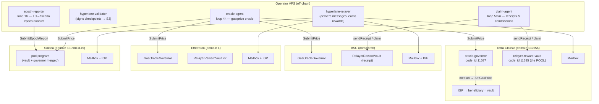
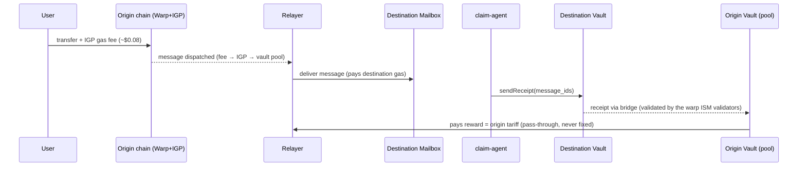
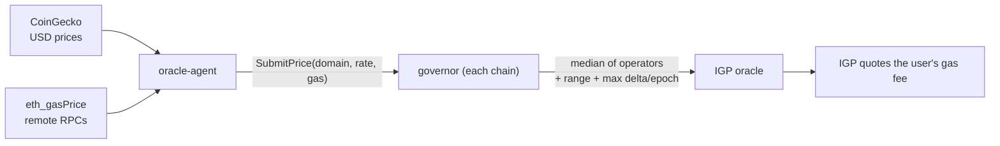

# Operator Install Guide — oracle-agent · claim-agent · epoch-reporter

> How to install and run the **off-chain operator services** of tc-proof-of-delivery
> on a VPS, in one shot. This is one of the two entry-point documents of the project —
> the other is the consolidated [AUDIT.md](AUDIT.md).

---

## 1. Architecture

### 1.1 Component chart (organogram) — who runs what, where



**Roles.** The relayer delivers bridge messages and is paid by the vaults; the three
services in this guide are its **support crew**: `oracle-agent` keeps the gas oracles
honest (so the IGP charges the right fee), `claim-agent` turns deliveries into receipts
and collects the rewards, `epoch-reporter` closes Solana epochs. Whoever operates the
relayer runs all of them.

### 1.2 Flow chart — how a delivery becomes a payment



And the oracle price flow that keeps the tariff correct:



The agent **has no power**: the governor applies the **median** of all operators'
submissions, clamped to governance-defined **ranges** and a **max delta per epoch**.
A compromised agent at worst submits a number the others do not confirm.

---

## 2. Prerequisites

| Item | Requirement |
|---|---|
| VPS | 2 vCPU / 4 GB RAM / 40 GB disk, Ubuntu 22.04+ |
| Node.js | **v20+** (`node -v`) |
| Repo | `git clone https://github.com/terra-classic-hyperlane/proof-of-delivery` |
| RPCs | defaults in `rpc.env` work (Hexxagon TC, publicnode BSC/ETH, Solana mainnet) |
| relayer/validator | separate install — see `../RELAYER-VPS.md` (not covered here) |

### Wallets & funding

Use a **tooling wallet** for these services, separate from the relayer wallet
(avoids account-sequence contention). Fund it with small amounts of gas:

| Chain | Used by | Needs |
|---|---|---|
| Terra Classic | claim-agent | LUNC for receipt txs |
| BSC | claim-agent, oracle-agent | BNB (only spends when drift >300bps or receipts pending) |
| Ethereum | oracle-agent | ETH (rarely — only on drift >300bps) |
| Solana | epoch-reporter, oracle-agent | SOL (~0.1; the round rent is paid once per domain) |

---

## 3. One-shot install

```bash
cd proof-of-delivery
bash deploy/install-operator.sh
```

The script (idempotent — re-run it to update code; it **never** touches your
`.env`/`config.json`/`state.json`):

1. Creates `/root/oracle-agent` and `/root/claim-agent` (+ `logs/`) and copies the code;
2. Installs npm dependencies;
3. Creates `config.json` and `.env`/`rpc.env` **templates** if they don't exist;
4. Installs + enables 3 systemd units (`oracle-agent`, `claim-agent`, `epoch-reporter`).

Then fill in every variable per **section 4** below and start:

```bash
systemctl start oracle-agent claim-agent epoch-reporter
```

---

## 4. Configuration reference — every variable, file by file

Keys are read **only from environment variables** — never stored in config files.
The env-var *names* are not fixed: `config.json` says which env each chain reads
(`privateKeyEnv` / `mnemonicEnv` / `keypairEnv`). The names below are the defaults
the installer templates use.

### 4.1 `/root/oracle-agent/.env` — oracle operator keys

| Variable | Format | Notes |
|---|---|---|
| `TC_PRIVATE_KEY` | raw **hex** secp256k1 key (no `0x`) | Hyperlane relayer format. Alternative: set `TC_MNEMONIC` (BIP-39 24 words) and point `mnemonicEnv` to it in config.json |
| `BSC_PRIVATE_KEY` | `0x`-prefixed hex EVM key | must be a **registered price operator** on the BSC governor |
| `ETH_PRIVATE_KEY` | `0x`-prefixed hex EVM key | registered operator on the ETH governor |
| `SOL_PRIVATE_KEY` | **hex** 32-byte ed25519 seed | Hyperlane relayer format. Alternative: `SOLANA_KEYPAIR_PATH=/path/keypair.json` (config `keypairEnv`) |

### 4.2 `/root/claim-agent/.env` — tooling wallet keys (claim-agent + epoch-reporter)

Use a **separate wallet** from the relayer (avoids account-sequence contention).

| Variable | Format | Used for |
|---|---|---|
| `TC_PRIVATE_KEY` | raw hex (no `0x`) — or `TC_MNEMONIC` (24 words) | signing receipt-delivery txs on Terra Classic |
| `BSC_PRIVATE_KEY` | `0x`-prefixed hex | `sendReceipt` on the BSC vault |
| `SOLANA_PRIVATE_KEY` | hex 32-byte ed25519 seed — or `SOLANA_KEYPAIR=/path.json` | epoch-reporter submissions (must be a registered pod operator) |

Optional tuning (set in the same `.env`; sensible defaults apply):
`DRY=1` (simulate, sign nothing) · `LOOKBACK_BLOCKS` (BSC scan window) ·
`MIN_BATCH` (min receipts per tx) · `STUCK_MINUTES` (re-send threshold).

### 4.3 `/root/claim-agent/rpc.env` — endpoints

| Variable | Default | Consumed by |
|---|---|---|
| `TC_RPC` | `https://rpc.terra-classic.hexxagon.io` | tx broadcast on TC |
| `TC_LCD` | `https://lcd.terra-classic.hexxagon.io` | queries (vault state, mailbox proofs) |
| `BSC_RPC` | `https://bsc-rpc.publicnode.com` | BSC scans + `sendReceipt` |
| `ETH_RPC` | `https://ethereum-rpc.publicnode.com` | reserved (ETH receipt replication) |
| `SOLANA_RPC` | `https://api.mainnet-beta.solana.com` | epoch-reporter |

Any endpoint can be swapped for your own node — these are public defaults.

### 4.4 `/root/oracle-agent/config.json` — the oracle map

Created from `config.example.json`, whose values **already match production** —
normally you only touch the `*Env` names and RPCs. Field meaning:

**Top level**

| Field | Meaning |
|---|---|
| `intervalSeconds` | seconds between rounds (production: `14400` = 4 h) |
| `coingecko.ids` | CoinGecko id per coin name used in `localCoin`/`remotes.*.coin` |

**Per chain — `chains.<name>` (common fields)**

| Field | Meaning |
|---|---|
| `type` | `cosmwasm` \| `evm` \| `solana` — selects the submitter module |
| `enabled` | `false` skips the chain without deleting its config |
| `localCoin` | CoinGecko key of the chain's native token |
| `rpc` | RPC used to submit `SubmitPrice` |
| `governor` / `oracle` | governor contract that receives submissions / IGP oracle it drives |
| `privateKeyEnv` · `mnemonicEnv` · `keypairEnv` | **names of the env vars** holding the key (see 4.1) |
| `remotes.<domain>` | one entry per remote domain priced on this chain (below) |

**Type-specific**: `cosmwasm` also needs `chainId` (`columbus-5`), `gasPrice`
(`28.325uluna`), `prefix` (`terra`); `solana` uses `governorProgram`, `igpProgram`,
`igpAccount` instead of `governor`/`oracle`.

**Per remote — `remotes.<domain>`**

| Field | Meaning |
|---|---|
| `coin` | CoinGecko key of the remote's native token (rate = remote/local × scale) |
| `gasPriceSource` | `{"type":"evm-rpc","url":…}` = live `eth_gasPrice` · `{"type":"fixed","value":…}` = constant (used for TC=`29`, Solana=`1`) |

**`claims` subsection** (optional, per chain): the delivery-sweep settings —
`mailbox`, `vault`, `igp`, `relayer` (whose deliveries are claimed), `lcd`,
`sweepMinUluna` (min amount worth sweeping), `originSenders` (warp senders →
domain map), `chunkBlocks`/`maxWindows` (EVM scan batching), `localClaim`
(false = payment happens at origin only). Defaults = production addresses.

---

## 5. Verify & operate

```bash
# all three must be "active"
systemctl is-active oracle-agent claim-agent epoch-reporter

# live logs
tail -f /root/oracle-agent/logs/agent.log     # "stable (<300bps) — no submission" = healthy
tail -f /root/claim-agent/logs/agent.log      # "receipts pending delivery on TC: 0" = healthy
tail -f /root/claim-agent/logs/reporter.log   # "epoch already reported/open — nothing to do" = healthy

# vault solvency (pool must equal claims_payable)
curl -s "https://lcd.terra-classic.hexxagon.io/cosmwasm/wasm/v1/contract/terra1gqkrh2va5mqdrlp90ez6lc2hgagxqju6fc7md4kldlz8lap9w4usduzc2q/smart/$(echo -n '{"pool":{}}' | base64 -w0)"
```

Cadence reference: oracle-agent rounds every **4 h**, only submits when drift
> **300 bps**; epoch = **6 h**; governor max delta = **2000 bps** per epoch.

### Log rotation — 1 GB hard cap

The installer sets up an hourly size check: any log that crosses **1 GB** is cut
(`copytruncate` — services keep writing, no restart needed) and one compressed
copy is kept. Config: `/etc/tc-pod-logrotate.conf` · trigger:
`/etc/cron.hourly/tc-pod-logrotate`. Verify with:

```bash
/usr/sbin/logrotate -d --state /var/lib/logrotate/tc-pod.status /etc/tc-pod-logrotate.conf
du -sh /root/oracle-agent/logs /root/claim-agent/logs
```

## 6. Troubleshooting

| Symptom | Cause / fix |
|---|---|
| `DeltaExceeded` / `out of bounds` in oracle log | real market moved beyond the governor's range — self-heals when gas returns, or governance ForceSet |
| `insufficient lamports` on Solana | fund the operator wallet with SOL |
| RPC timeouts / 429 | swap the RPC in `rpc.env` / `config.json` |
| service `activating` in a loop | `journalctl -u <name> -n 50` — usually an empty env var |

Deep dives: `../ORACLE-AGENT.md` · `../CLAIM-AGENT-INSTALL.md` · `../VAULT.md` ·
`../TRUSTLESS-RECEIPT.md` · `../OPERATOR-INSTALL-RELAYER-ORACLE-VAULT.md` (full node incl. relayer).
