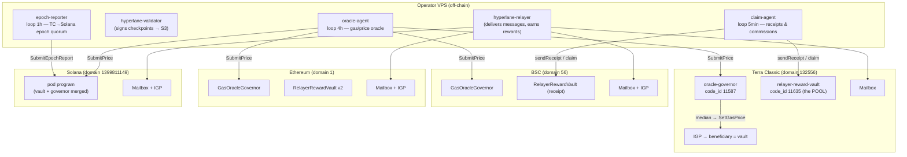
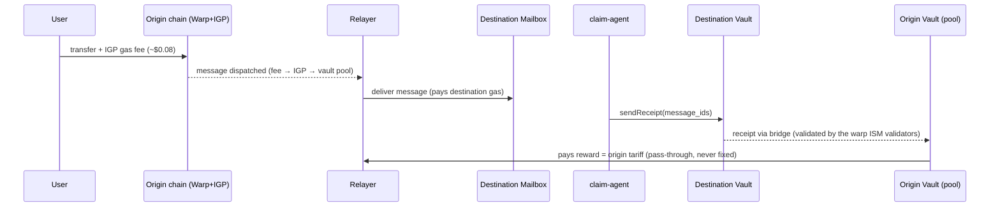
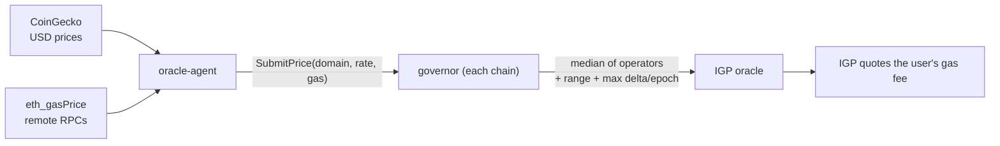

# Operator Install Guide — oracle-agent · claim-agent · epoch-reporter

> How to install and run the **off-chain operator services** of tc-proof-of-delivery
> on a VPS, in one shot. This is one of the two entry-point documents of the project —
> the other is the consolidated [AUDIT.md](AUDIT.md).

---

## 1. Architecture

### 1.1 Component chart (organogram) — who runs what, where



**Roles.** The relayer delivers bridge messages and is paid by the vaults; the three
services in this guide are its **support crew**: `oracle-agent` keeps the gas oracles
honest (so the IGP charges the right fee), `claim-agent` turns deliveries into receipts
and collects the rewards, `epoch-reporter` closes Solana epochs. Whoever operates the
relayer runs all of them.

### 1.2 Flow chart — how a delivery becomes a payment



And the oracle price flow that keeps the tariff correct:



The agent **has no power**: the governor applies the **median** of all operators'
submissions, clamped to governance-defined **ranges** and a **max delta per epoch**.
A compromised agent at worst submits a number the others do not confirm.

---

## 2. Prerequisites

| Item | Requirement |
|---|---|
| VPS | 2 vCPU / 4 GB RAM / 40 GB disk, Ubuntu 22.04+ |
| Node.js | **v20+** (`node -v`) |
| Repo | `git clone https://github.com/terra-classic-hyperlane/proof-of-delivery` |
| RPCs | defaults in `rpc.env` work (Hexxagon TC, publicnode BSC/ETH, Solana mainnet) |
| relayer/validator | separate install — see `../RELAYER-VPS.md` (not covered here) |

### Wallets & funding

Use a **tooling wallet** for these services, separate from the relayer wallet
(avoids account-sequence contention). Fund it with small amounts of gas:

| Chain | Used by | Needs |
|---|---|---|
| Terra Classic | claim-agent | LUNC for receipt txs |
| BSC | claim-agent, oracle-agent | BNB (only spends when drift >300bps or receipts pending) |
| Ethereum | oracle-agent | ETH (rarely — only on drift >300bps) |
| Solana | epoch-reporter, oracle-agent | SOL (~0.1; the round rent is paid once per domain) |

---

## 3. One-shot install

```bash
cd proof-of-delivery
bash deploy/install-operator.sh
```

The script (idempotent — re-run it to update code; it **never** touches your
`.env`/`config.json`/`state.json`):

1. Creates `/root/oracle-agent` and `/root/claim-agent` (+ `logs/`) and copies the code;
2. Installs npm dependencies;
3. Creates `config.json` and `.env`/`rpc.env` **templates** if they don't exist;
4. Installs + enables 3 systemd units (`oracle-agent`, `claim-agent`, `epoch-reporter`).

Then fill in the secrets and start:

```bash
nano /root/oracle-agent/.env      # TC/BSC/ETH/SOL private keys (oracle operator)
nano /root/claim-agent/.env       # TC/BSC/SOLANA private keys (tooling wallet)
nano /root/oracle-agent/config.json   # governors/RPCs/domains (defaults = production)
systemctl start oracle-agent claim-agent epoch-reporter
```

Keys are read **only from environment variables** — never stored in config files.

---

## 4. Verify & operate

```bash
# all three must be "active"
systemctl is-active oracle-agent claim-agent epoch-reporter

# live logs
tail -f /root/oracle-agent/logs/agent.log     # "stable (<300bps) — no submission" = healthy
tail -f /root/claim-agent/logs/agent.log      # "receipts pending delivery on TC: 0" = healthy
tail -f /root/claim-agent/logs/reporter.log   # "epoch already reported/open — nothing to do" = healthy

# vault solvency (pool must equal claims_payable)
curl -s "https://lcd.terra-classic.hexxagon.io/cosmwasm/wasm/v1/contract/terra1gqkrh2va5mqdrlp90ez6lc2hgagxqju6fc7md4kldlz8lap9w4usduzc2q/smart/$(echo -n '{"pool":{}}' | base64 -w0)"
```

Cadence reference: oracle-agent rounds every **4 h**, only submits when drift
> **300 bps**; epoch = **6 h**; governor max delta = **2000 bps** per epoch.

## 5. Troubleshooting

| Symptom | Cause / fix |
|---|---|
| `DeltaExceeded` / `out of bounds` in oracle log | real market moved beyond the governor's range — self-heals when gas returns, or governance ForceSet |
| `insufficient lamports` on Solana | fund the operator wallet with SOL |
| RPC timeouts / 429 | swap the RPC in `rpc.env` / `config.json` |
| service `activating` in a loop | `journalctl -u <name> -n 50` — usually an empty env var |

Deep dives: `../ORACLE-AGENT.md` · `../CLAIM-AGENT-INSTALL.md` · `../VAULT.md` ·
`../TRUSTLESS-RECEIPT.md` · `../OPERATOR-INSTALL-RELAYER-ORACLE-VAULT.md` (full node incl. relayer).
